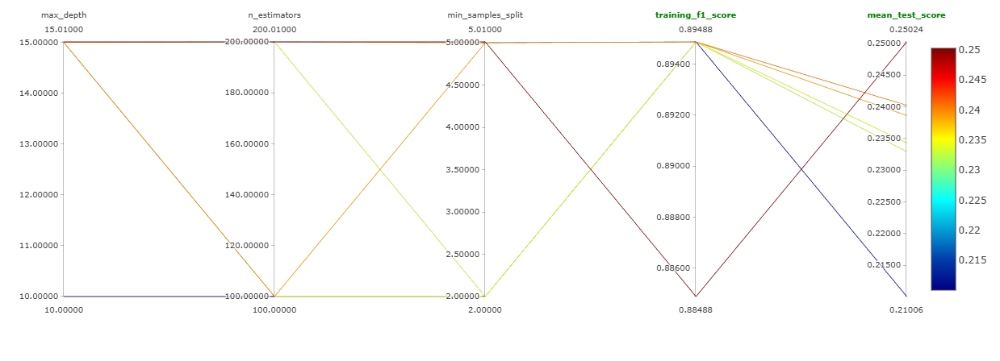
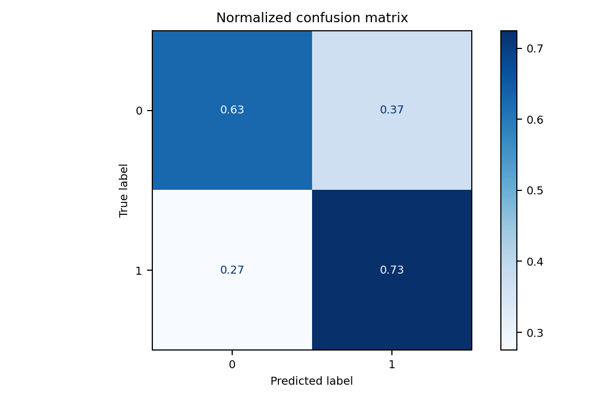

# Olist Delivery Prediction: Solução End-to-End com MLOps

Este projeto desenvolve um sistema de inteligência preditiva para identificar riscos de atraso em entregas de e-commerce utilizando o dataset da Olist. A solução foca na construção de um pipeline de MLOps estruturado, garantindo reprodutibilidade, versionamento de dados e monitoramento de experimentos.

## Resumo Executivo
O objetivo principal é prever a probabilidade de um pedido atrasar no momento da compra. O projeto evoluiu de um modelo básico para uma solução otimizada que utiliza engenharia de features avançada e busca automática de hiperparâmetros, resultando em um ganho de performance de 50% no F1-Score.

## Stack Tecnológica
* Linguagem: Python.
* Machine Learning: Scikit-Learn (Random Forest).
* MLOps e Versionamento: DVC (Data Version Control) e Git.
* Tracking de Experimentos: MLflow e DagsHub.
* Ambiente: VS Code e Virtualenv.

## Arquitetura do Pipeline (DVC)
O projeto é modularizado em estágios automatizados via DVC, permitindo que alterações em qualquer etapa disparem apenas os reprocessamentos necessários:

1. Ingestion: Consolidação de 5 bases de dados (Pedidos, Itens, Produtos, Clientes e Vendedores).
2. Preprocessing: Limpeza e criação de variáveis de negócio (Feature Engineering).
3. Training: Execução de Grid Search com rastreamento automático no MLflow.

## Engenharia de Features: Domínio de Negócio
A inteligência do modelo foi construída sobre variáveis que capturam a complexidade logística brasileira:
* Logística Interestadual: Criação da flag is_interstate para identificar rotas que cruzam fronteiras estaduais.
* Contexto Físico: Cálculo de volume (cm³) e peso bruto para mensurar a dificuldade de transporte.
* Janela Temporal: Extração do prazo prometido pela plataforma e o dia da semana da compra.

## Resultados e Otimização de Hiperparâmetros
Utilizando o GridSearchCV, testei sistematicamente diferentes configurações de profundidade e estimadores. O monitoramento via Parallel Coordinates Plot permitiu identificar a convergência para o melhor modelo final.

| Métrica | Baseline | Modelo Final (Otimizado) |
| :--- | :--- | :--- |
| F1-Score | 0.1669 | 0.2502 |
| Acurácia | 95.30% | 97.38% |

### Visualização da Otimização
O gráfico de coordenadas paralelas demonstra como a combinação de max_depth=15 e n_estimators=200 maximizou a métrica de teste durante a validação cruzada.

## Análise de Risco e Inferência
Abaixo, a matriz de confusão demonstra a capacidade do modelo em distinguir entre entregas no prazo e atrasos reais após a fase de regularização e busca de parâmetros.

Diferente de uma classificação estática, o modelo fornece a Probabilidade de Atraso, permitindo uma gestão proativa da operação:

* Cenário de Baixo Risco: Pedidos locais e leves apresentam risco de 21,44%.
* Cenário de Alto Risco: Pedidos pesados e interestaduais elevam o risco para 43,02%.

O aumento de 100% no risco detectado pelo modelo permite ações preventivas antes da falha na entrega.

## Como Executar
1. Clone o repositório: git clone (url-do-repositorio).
2. Ative o ambiente virtual: .\venv\Scripts\activate.
3. Reproduza o pipeline: dvc repro.
4. Explore as predições no notebook: predict.ipynb.
